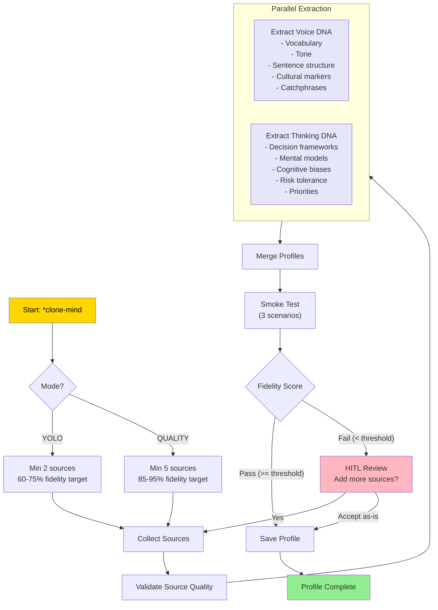
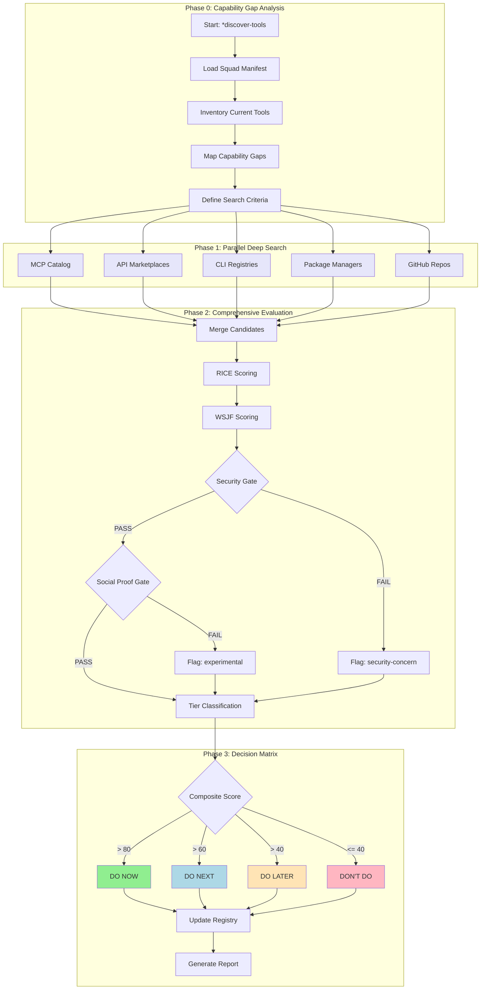
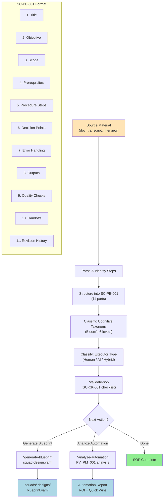
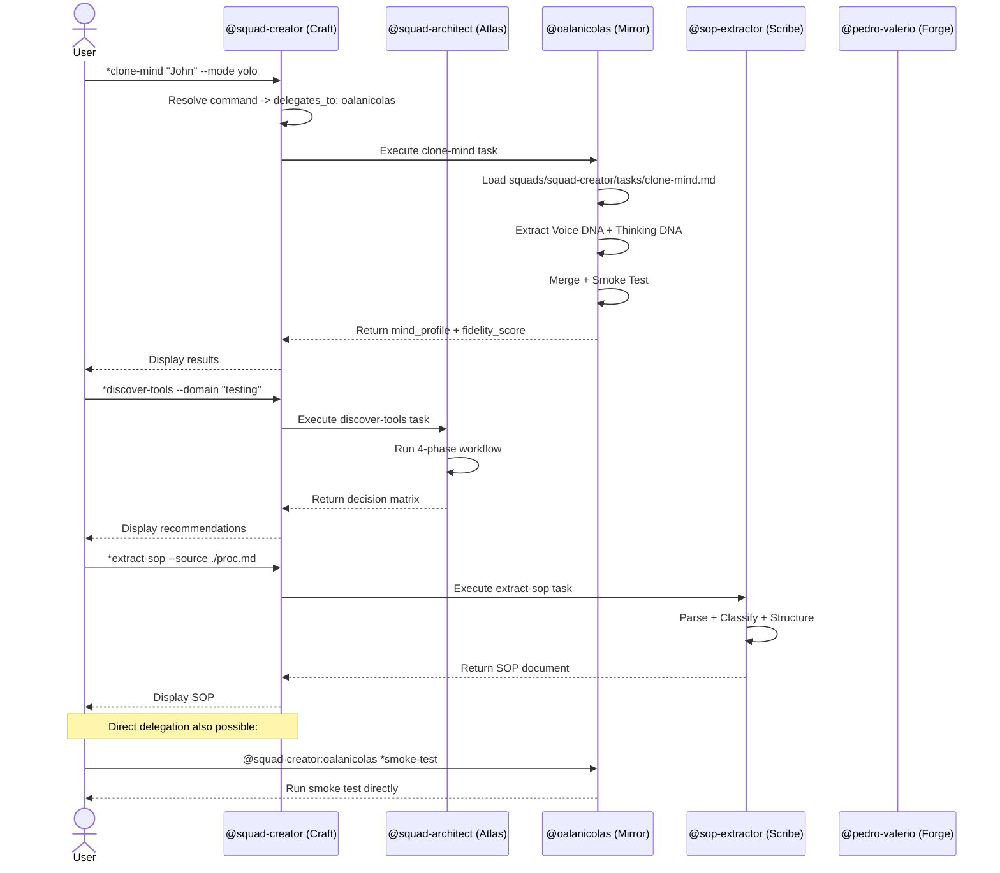
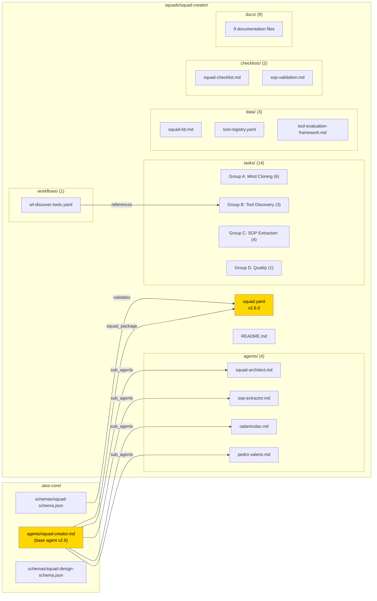

# Architecture Diagrams

> Visual architecture reference for Squad Creator v2.6
> All diagrams use Mermaid syntax for portability

---

## 1. Overall Squad Creator Architecture

The base agent (Craft) orchestrates 4 specialist sub-agents. Each sub-agent owns specific tasks and can be accessed directly via delegation.

```mermaid
graph TD
    USER[User] --> SC["@squad-creator (Craft)"]

    SC --> SA["@squad-architect (Atlas)"]
    SC --> SE["@sop-extractor (Scribe)"]
    SC --> MC["@oalanicolas (Mirror)"]
    SC --> PV["@pedro-valerio (Forge)"]

    subgraph "Squad Management"
        SC --> T1["*design-squad"]
        SC --> T2["*create-squad"]
        SC --> T3["*validate-squad"]
        SC --> T4["*analyze-squad"]
        SC --> T5["*extend-squad"]
        SC --> T6["*list-squads"]
    end

    subgraph "Mind Cloning"
        MC --> M1["*clone-mind"]
        MC --> M2["*extract-voice-dna"]
        MC --> M3["*extract-thinking-dna"]
        MC --> M4["*update-mind"]
        MC --> M5["*auto-acquire-sources"]
        MC --> M6["*smoke-test"]
    end

    subgraph "Tool Discovery"
        SA --> D1["*discover-tools"]
        SA --> D2["*show-tools"]
        SA --> D3["*add-tool"]
        SA --> D4["*quality-dashboard"]
    end

    subgraph "SOP Extraction"
        SE --> S1["*extract-sop"]
        SE --> S2["*validate-sop"]
        SE --> S3["*generate-blueprint"]
        SE --> S4["*analyze-automation"]
    end

    subgraph "Process Design"
        PV --> P1["*design-workflow"]
        PV --> P2["*design-checklist"]
        PV --> P3["*define-veto-conditions"]
        PV --> P4["*analyze-process"]
    end

    style SC fill:#FFD700,color:#000
    style SA fill:#ADD8E6
    style SE fill:#90EE90
    style MC fill:#E6E6FA
    style PV fill:#FFE4B5
```

---

## 2. Mind Cloning Pipeline

Full pipeline from source acquisition through profile generation and validation.

---

## 3. Tool Discovery Workflow (4 Phases)

---

## 4. SOP Extraction Flow

---

## 5. Agent Delegation Flow

How commands flow from the base agent to specialist sub-agents.

---

## 6. Squad Package Structure

---

*Diagrams rendered with Mermaid — compatible with GitHub, VS Code, and most markdown renderers.*
